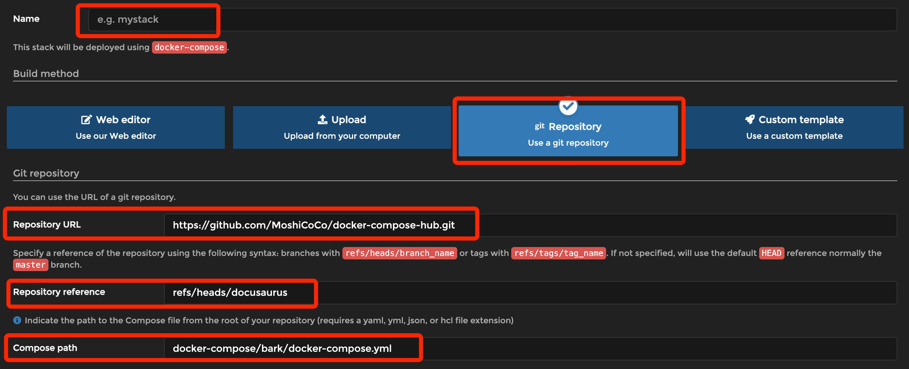

<div align="center">
<h1 align="center">Docker Compose Hub</h1>
</div>

## 关于仓库

本仓库提供了多种常见Docker镜像的Compose容器编排脚本和基本配置文件，支持`docker-compose`,`docker run`,`portainer`
一键导入等多种启动方式,可以协助你使用Docker快速完成基础的（开发，应用）环境搭建。

**针对无需配置的docker容器,你可以在克隆仓库后,使用`docker-compose up -d` 命令快速启动** 以MySQL为例:

```bash
cd docs/mysql && docker-compose up -d 

# or
# 此命令需要高版本docker engine 支持

cd docs/mysql && docker compose up -d 
```

## 目前支持的镜像列表

目前涵盖了我常用的开发环境和工具环境，文档描述比较粗糙，后续会润色。部分是 docker run 命令，后续会增加 docker-compose.yml 文件

- Docker 和 Docker-Compose 的安装请参考 [docker 和 docker-compose 的安装](docs/docker/install-docker-and-compose.md)

- 如果想简单修改 `docker-compose.yml` 文件配置，但是又不懂 `compose`
  文件的配置含义,请简单阅读 [compose 文件结构释义](docs/docker/about-compose.md)
  或者阅读`docker`官方文档[Compose file reference](https://docs.docker.com/compose/compose-file/)

### 基础开发环境

此处的容器为单个容器，按需求启动。

- [Portainer](docs/dev-environment/portainer/server)  docker容器管理工具，包括server和edgeagent
- [MySQL](docs/dev-environment/mysql)
- [Redis](docs/dev-environment/redis)
- [Redis 集群（3 主 3 从）](docs/dev-environment/redis-cluster)
- [Rabbit MQ](docs/dev-environment/rabbit-mq)
- [Nginx Consul Registrator](docs/dev-environment/nginx-consul-registrator)
- [MinIO](docs/dev-environment/minio)
- Nacos
- ShardingSphere-Proxy
- .....

### 常用工具

- [Vaultwarden](docs/tool/vaultwarden) 密码管理器
- [Qinglong](docs/tool/qinglong) 脚本运行服务
- [Bark Server](docs/tool/bark) 消息推送服务端
- [Drawio](docs/tool/drawio) 画图工具，流程图，UML 等
- [Acme.sh](docs/tool/acme-sh) 免费 SSL 生成工具
- [Halo](docs/tool/halo) Halo 博客
- [Frp](docs/tool/frp) frp 代理服务器
- [Netdata](docs/tool/netdata) Netdata 网络监控工具
- [WordPress](docs/tool/wordpress) WordPress博客
- .....

详细支持列表请查阅 [完整的镜像列表](docs/projet-info/support-list.md)

## 使用方式

### 使用Portainer Stacks启动容器

1. 点击Add stack，输入stackName。build method选择Git Repository (也可以选择upload方式,手动上传docker-compose.yml文件)
2. 填写仓库信息

    - Repository URL: <https://github.com/MoshiCoCo/docker-compose-hub.git>
    - Repository reference :refs/heads/docusaurus
    - Compose path :docker-compose/xxx/docker-compose.yml （其中xxx填写你需要的服务名路径，比如mysql）



### 使用docker-compose命令启动容器

```bash
# 1
git clone https://github.com/MoshiCoCo/docker-compose-hub.git

# 2
cd /docker-compose-hub/docs/mysql && docker-compose up -d 

# or
# 此命令需要高版本docker engine 支持

cd docs/mysql && docker compose up -d 
```

## 一些约定

在 docker-compose.yml 配置文件中，有些参数是可变的,以redis镜像的docker-compose编排文件为例:

```yaml
version: "3"
services:
  redis:
    image: redis
    restart: always
    container_name: redis-6000
    volumes:
      - $PWD/data:/data
      - $PWD/logs:/logs
    command: redis-server --requirepass <your-redis-connaction-password>
    ports:
      - "6000:6379"
```

1. 密码相关

此处的 `command: redis-server --requirepass <your-password>` 是用于设置一个 redis 连接密码，该密码由用户自己生成。
本项目中此类均以`< some user password or username >`的形式展示，用户在实际填写时请勿保留`< >` .

如果你的密码是 `wodemimashi123`

正确写法：`command: redis-server --requirepass wodemimashi123`

错误写法：`command: redis-server --requirepass <wodemimashi123>`

## 参与贡献

```bash
npm intsll && npm install -g pnpm && pnpm install
```

请按照模板文件`/template`的格式填写，并将文件放置到 `docs/` 目录下对应的类别中

格式检查

```bash
pnpm lint
#或者npm run lint
```

## ⭐️Stars

[](https://starchart.cc/MoshiCoCo/docker-compose-hub)
